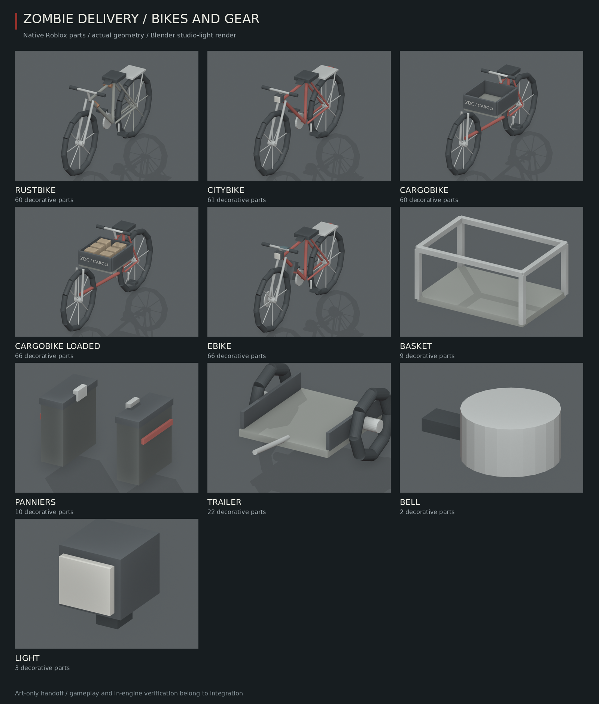
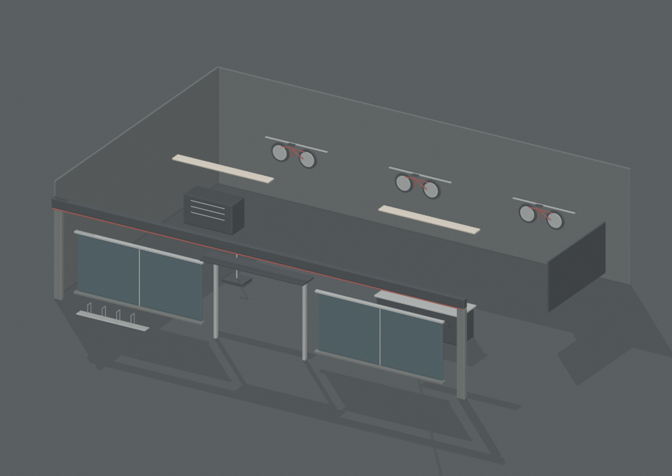

# Bikes, gear and Spoke & Chain — 5.x art handoff

`server/BikeArt/Geometry.luau` is pure native geometry; `ModelArt/Builder` welds it to caller-supplied roots. No meshes, controllers, balance simulation, seats, gameplay cargo or save edits. Forward -Z, up +Y, cylinder axis X. Tyres are hollow twelve-segment rings with four crossed full-diameter spokes, rather than solid discs.

| Model | Skin parts + new roots | Budget |
|---|---:|---:|
| rustbike | 60 + 4 = 64 | 70 |
| citybike | 61 + 4 = 65 | 70 |
| cargobike | 60 + 4 = 64 | 70 |
| cargobike_loaded (review sample) | 66 + 4 = 70 | 70 |
| ebike | 66 + 4 = 70 | 70 |
| basket | 9 + 1 = 10 | 10 |
| panniers | 10 + 1 = 11 | 12 |
| trailer | 22 + 3 = 25 | 25 |
| bell / light | 2 / 3 + 1 mount each | 3 / 4 |

Budgets include the new hidden attachment roots. The gameplay-only seat/collider and additional gear are separate integration costs. The four main bikes are about 6.6 studs long (cargo about 6.9); wheel radius is about 1.3 and frame width about .3, handlebar width about 1.6. Rusty has worn tubes and mismatched wheel finishes; Courier has a lamp and clean red frame; Cargo has a low extended beam and front box; E-Bike has battery, display and rotating brake discs.

## Assemblies and pose/cargo points

- `Geometry.pieces(id)` / `spec(id)` give the source geometry, points and review-only root `origins`. Create targets `Frame`, `FrontWheel`, `RearWheel`, `Crank` at those offsets from the bike's ground origin. Wheels spin around **local X**, with pivots at the axles; crank rotates around X too. Weld only Frame to the game chassis. Claude supplies independent motors for the other three roots. Both pedals currently follow Crank; counter-rotation of pedals is an integration choice.
- `Saddle`, `LeftGrip`, `RightGrip` are relative to Frame; `LeftPedal`, `RightPedal` relative to Crank. `FrontAxle`, `RearAxle`, `CrankAxis` are Frame attachments locating the assembly pivots. Use these to pose the rider, not hardcoded offsets. No character joint C0 edits.
- `BasketMount`, `PannierMount`, `BellMount`, `LightMount`, `Hitch` are Frame points. A gear `Mount` root can be placed at the chosen point's WorldCFrame. The Cargo Bike's basket mount is ahead of the box, not through it; its low frame/fork leaves the box interior clear. Claude chooses allowed gear combinations and capacities.
- Ordinary bikes have a rear-rack `Slot1`; Cargo has six box-floor `Slot1`–`Slot6` points. Basket has two, panniers two, trailer four. These are layout points, not a change to cargo rules. Pannier slots are at the bags' openings; others at deck height.
- `cargobike_loaded` is **only a preview variant with six sample parcels**. Use `cargobike` in production and create actual cargo from its six slot points. Do not give a player those decorative sample parcels as a delivery.
- Trailer roots: `Frame`, `LeftWheel`, `RightWheel`. Align its forward `Hitch` with the bike's rear `Hitch`, using Claude's hitch/push controller. Wheels are hollow eight-segment rings and rotate separately. Extra trailer colliders/joints are not provided.
- All decoration is massless/non-colliding/non-querying/non-touching; spokes, strips and small pieces cast no shadows. Parts with `NightLamp=true` need registration with DayNight. If initially built on anchored preview roots, unanchor **built.parts as well as the roots** before driving. Call `Builder.destroy(result)` before replacing skins/gear to remove points from caller roots.

## Shop blueprint

`server/BuildingLooks/BikeShop.luau`: 60×40×16, **71 detail parts + 2 Kit interior lamps**, one clear **12-wide / 10-high** front opening. Floor-centered origin, front -Z. Counter, RENT / BUY / REPAIR plate, three wall-rack bikes, stand, tool chest, spare tyres, outside tubular bike rack. Claude supplies the shell, door, prompts and placement on Downtown block **(-1, 1)**. Reserve the normal name board at y≈17.2, in front of z=-20.7; `sign()` should say **SPOKE & CHAIN CYCLES**. The facade details stay below the board.

Use the existing `BuildingLooks/Kit.build` with World's nonblocking helpers; decoration context must set Massless. `shop.png` records the actual Kit geometry and adds only a clearly documented **preview floor and rear/right cutaway walls**. Those reference walls are not exported by the blueprint and do not replace Claude's gameplay shell.

Eight 256px white transparent PNG/SVG icons are in `art/icons/`: four `bike_*`, `gear_basket`, `gear_panniers`, `gear_trailer`, `map_bikes`. Claude registers image IDs; no `Icons.luau` edits here.

## Checks / Studio review

Required test suite and every source compile at `-O0 -g2` pass. Real art-builder audits cover budgets including hidden roots, both spinning wheel targets, crank/pedal points, slots, circular cylinder axes, flags/welds, labels and cleanup. All building blueprints pass the existing checker, now extended to project rotated geometry bounds and record real frame rotations; this extension was necessary for native tubes/discs. White SVG/PNG dimensions/transparency pass.

Reproduce via `tools/model-art/README.md`; use BikeArt as export input. Export the shop with `tools/model-art/blueprints.py`, then the same renderer. No Roblox Studio here: Claude should check rider sit/hand/pedal alignment, wheel/crank rotation, loading six pieces, individual gear and trailer clearance, phone/backpack coexistence, shop door/sign/prompt paths and phone performance. Every model is art-only until wired into gameplay.
