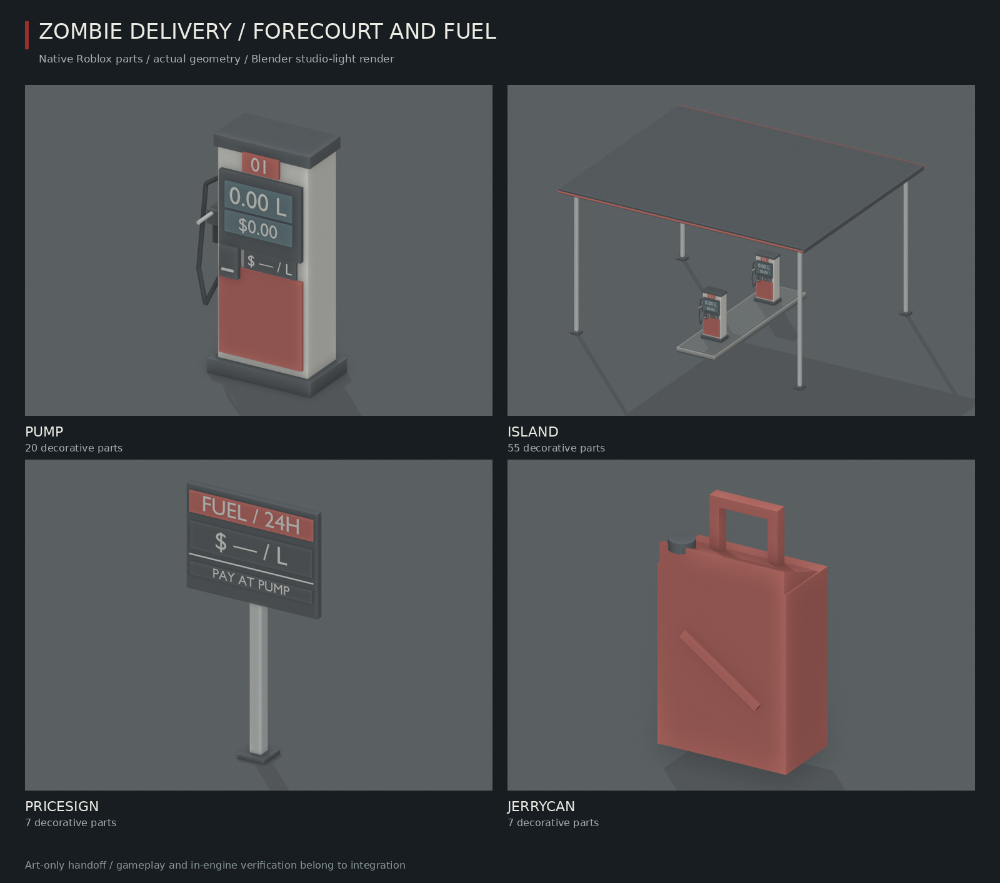
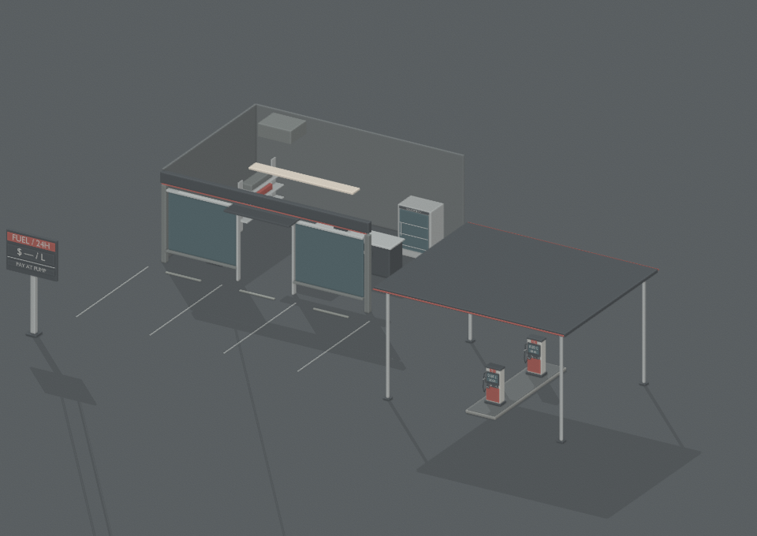
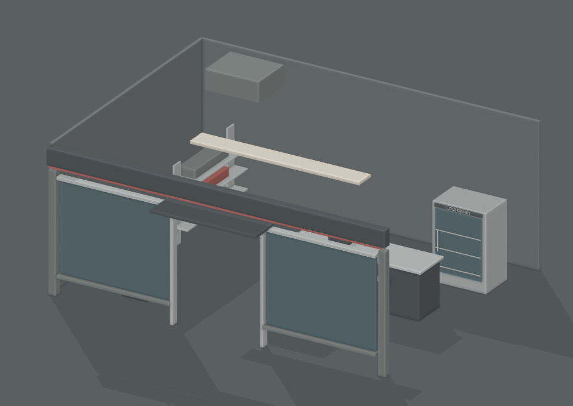

# Forecourt and fuel — 5.x art handoff

All model geometry is native Parts/WedgeParts/Cylinders, pure data under `server/GasArt/`. `ModelArt/Builder` provides only massless, non-colliding/non-querying/non-touching welded decoration. Small pieces cast no shadows. Claude supplies colliders, prompts, fuel/payment/ownership behavior and placement at the existing Gas Station, Downtown edge, Harbor and Suburbs. No Jobs/Cargo/Vehicles/PlayerData or other gameplay files changed.

| Component | Parts including new caller roots / lamps | Budget |
|---|---:|---:|
| pump | 20 + Frame/Nozzle = 22 | 25 |
| island | 55 + Frame/Nozzle1/Nozzle2 = 58 | 70 |
| kiosk | 39 + 1 Kit interior lamp = 40 | 60 |
| pricesign | 7 + Frame = 8 | 12 |
| jerrycan | 7 + Frame = 8 | 8 |

## Model API and handoff points

- `GasArt/Geometry.pieces(id)` / `spec(id)` use the shared native art builder. Origin ground-centered, forward -Z; local Euler rotations in degrees, cylinders along X. `spec.origins` declares sample assembly offsets, not world placements.
- Pump has fixed `Frame` and independent `Nozzle` roots. **All three nozzle pieces weld only to Nozzle**. Place its root at `NozzleDock` (1.04, 2.3, 0) when parked; move/weld that caller-owned root to the hand while held. `NozzleGrip`, `FuelOutlet`, `HoseAnchor` points are supplied. Hide/replace the five `ParkedHose*` segments with Claude's dynamic hose while held; no stretchy hose controller is supplied here.
- Island: two pumps along Z ±4 on a kerbed island, a 22×18 canopy, four posts and two underside `NightLamp=true` panels. Caller targets are `Frame`, `Nozzle1`, `Nozzle2`. Points `Pump1Dock/HoseAnchor/Grip/FuelOutlet`, the equivalent Pump2 points, and `Bay1Left/Right`, `Bay2Left/Right` are named for integration. A 7-wide vehicle fits at x±5.2 between the island and posts; Claude must separately check the 9-wide Freight Truck and long vehicles before enabling those bays. Canopy underside clears a normal van; no physics guarantee is implied by the art-only clearance audit.
- Each pump display has named TextLabels under its part's `ArtLabel`: `Litres`, `Total`, `PricePerLitre`, `PumpNumber`. Island copies prefix these slots with `Pump1` or `Pump2`. The road sign has `PricePerLitre`. `$ — / L`, `0.00 L`, `$0.00` are placeholders: only the server's authoritative price/transaction should populate them. The sign's pole is behind its display, not through the price text.
- Jerry can: `CarryGrip` at the actual handle, `PourOutlet` at the cap with outward +Y normal. It is a visual carry prop; Claude attaches it and defines usable fuel/price/cargo rules.
- `GasArt/Fuelcaps.luau` supplies **positions only for all 17 current fleet styles**. `point(styleId, actualWidth?, actualLength?)` returns a `FuelFiller` point relative to **Chassis CENTER**, already including the .6-stud chassis-top offset. Normal faces outward +X (yaw -90°); align the nozzle outlet against that normal. Width scaling and stage stretch follow the cargo quarter. These authored positions still need visual review against body/armor/door skins; no flap parts or vehicle mutations are added.
- `Builder.destroy(result)` removes both skin and externally parented points. The builder never anchors skin parts, including those welded onto an anchored display root. Register `NightLamp` parts with DayNight during integration.

## Kiosk and station layout

`BuildingLooks/GasKiosk.luau` is a 24×18×10 Kit blueprint, front -Z, with a **6-wide / 7.3-high** doorway: glazing, counter/till, fridge, stocked shelves, ATM and roof unit. Claude supplies the shell and interactive behavior. Keep the usual `sign()` board at about y=11.2 above the facade. World decoration context must set Massless.

`GasArt/Layout.luau` is **one pure station assembly blueprint** for a 70×50 lot: `components` declare the island, kiosk and roadside sign positions, `pieces` declare parking markings/stops, `points` declare entrance/exit lanes and shop entry. Translate/rotate everything from the station floor frame. It reuses the subcomponents; do not also spawn duplicate standalone pumps. Price sign is outside the parking approach. This composition intentionally does not alter the existing World builder.

The kiosk/station renders execute the actual Kit/model geometry; only a documented floor and rear/right **reference cutaway walls** are added to make the kiosk interior readable. Those review walls are not part of the source blueprint. Blender lighting, glass and materials differ from Roblox Studio. No reference shell should be imported as gameplay collision geometry.

Three **256px white transparent PNG/SVG** icons: `art/icons/fuel`, `jerrycan`, `map_gas`. Claude registers IDs after upload; no icon registry edits here.

## Validation / Studio review

Required tests and all `-O0 -g2` module compiles pass. `tools/model-art/check_gas.py <luau> <output-folder>` executes real builders and checks component budgets (including roots/interior lamp), finite shapes, correct nozzle weld targets, label slots, flags/cleanup, full 70×50 bounds, bay/post clearance, two canopy night lamps and exact coverage of the 17 fleet styles. All building blueprints pass `tools/check-building-looks.py`; SVG/PNG dimensions, glyph whiteness and transparency pass. See `tools/model-art/README.md` for render commands.

**Claude's Studio review:** nozzle hold/dock orientation and dynamic hose, filler alignment on each stage/armor kit, display text and night lamps, normal/long/freight vehicle approaches, canopy and door clearance, can carry/pour pose, kiosk prompts and four rotated station placements. No fuel gameplay is wired in this branch.
