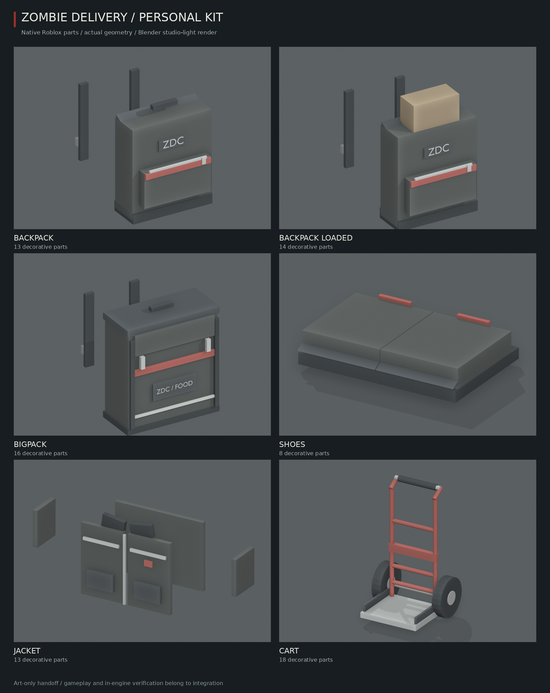

# Personal kit — 5.x art handoff

Native Parts, WedgeParts and Cylinders, charcoal cloth/rubber, worn steel and restrained red accents. No mesh or texture IDs. `shared/KitArt.luau` is pure data; Claude supplies its caller-owned R15 bones or cart assembly roots to `server/ModelArt/Builder.luau`.

| Model | Decorative parts | Budget |
|---|---:|---:|
| backpack | 13 | 14 |
| backpack_loaded | 14 | 14 |
| bigpack | 16 | 18 |
| shoes | 4 per foot | 6 per foot |
| jacket | 13 | 16 |
| cart | 18 + 3 caller roots = 21 | 22 |

## Integration

- `Geometry.pieces(id)` returns local `size`, `at`, `attach`, `finish`, optional degree `turn`, native `shape`, `shadow` and label `text`. `Geometry.spec(id)` adds the declared attachment points and review-only target `origins`. `Geometry.load()` returns the **one optional parcel**; toggle/rebuild it from authoritative cargo state. It is illustrative art, not an inventory slot or real delivery piece.
- Wearables weld separately to `UpperTorso`, `LeftUpperArm`, `RightUpperArm`, `LeftFoot`, `RightFoot`. Backpacks stay within ±1 stud of the torso center and above its hip line, leaving the arms free. The vest's sleeve panels follow their own upper-arm bones. No AnimationConstraint/C0 edits.
- Authored for a nominal block R15 torso (2 wide, about 1.6 high, 1 deep) and feet (1 wide, about .3 high, 1.2 deep). Scale/fit the data to actual avatar body proportions in integration. Confirm foot orientation and vest/pack layering for the game's chosen avatar; these are not catalog clothing replacements.
- Cart origin is ground under its axle, forward -Z. Provide independent `Frame`, `LeftWheel`, `RightWheel` target BaseParts at the `spec.origins` offsets. All rails/deck weld to Frame; each tyre/hub welds to its own wheel target. Claude supplies wheel joints, collider and push behavior. `HandleGrip`, `LeftGrip`, `RightGrip`, `Deck`, `LeftAxle`, `RightAxle` are named Attachments. `Deck` is .34 studs above ground, centered toward -Z; the handle is 3.57 studs high. Existing Equipment is unchanged.
- `Builder.build(parent, spec, targets)` returns `{model, parts, points}`. Use `Builder.destroy(result)` before rebuilding: attachment points live on caller-owned parts. Decoration is massless, non-colliding, non-querying and non-touching. Small pieces cast no shadows.
- Five white transparent **256×256 PNG + SVG** icons are in `art/icons/kit_*.{png,svg}`. Claude adds their names to `Icons.luau` after upload; no IDs or gameplay files changed here.

## Checked / review

The required `tests/run_tests.py` passes and every source module compiles at `-O0 -g2`. The real art builder is exercised by `tools/model-art/export.py`: part budgets (including new cart roots), circular-cylinder axes, finite sizes, shoulder/hip envelope, correct bone/assembly welds, decorative flags, labels, missing-target failure and attachment cleanup. SVG/PNG dimensions, white glyph pixels and transparency are checked too.

See `tools/model-art/README.md` for reproducible export, render and checker commands. `preview.png` is rendered from the actual builder-recorded geometry in Blender, with neutral studio lighting; it is not a Studio screenshot or a pose test.

**Claude's Studio review:** both arms carrying pieces, sprint/walk, sit/boarding, avatar scaling, combined vest + pack, shoes on moving feet, optional parcel visibility; cart grip alignment, deck loading and wheel rotation. The models remain art-only until Claude integrates them.
