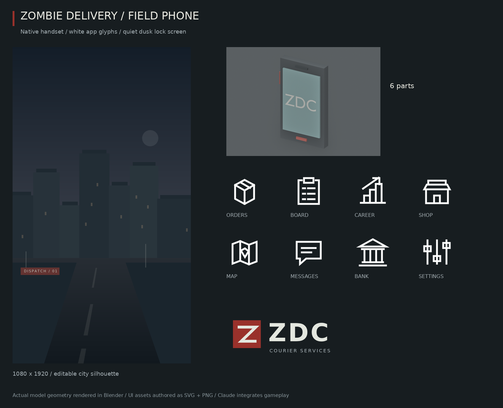

# Field phone — 5.x art handoff

`server/PhoneArt/Geometry.luau` exports `pieces("phone")` and `spec("phone")`: **6 native parts**, within the brief. The case is charcoal, the key/tab muted red, and the screen a dim teal Neon Part. No meshes or uploaded images are needed for the handset. All six pieces attach independently to caller-owned `RightHand` through `ModelArt/Builder`; decoration is massless/nonblocking and small parts have no shadows.

`PhoneGrip` and `PhoneScreenCenter` are Attachment points. The device's front faces -Z in RightHand local space; the center is offset (0, -.12, -.3). Claude supplies the phone-open pose, scales/fits it to the actual hand and calls `Builder.destroy(result)` on close/death/sit. Do not edit character C0. The default `Screen/ArtLabel/PhoneScreen` TextLabel is a splash placeholder; replace/mount the desired SurfaceGui on Screen during integration. The handset is a visual prop, not the interactive phone window.

## UI assets

- `art/icons/app_{orders,board,career,shop,map,messages,bank,settings}.{svg,png}`: **256×256**, white glyphs on transparent backgrounds. Distinct package, clipboard, career steps, shopfront, folded map, chat, bank and sliders silhouettes. Tint them through ImageColor3; no colored rounded-square backgrounds baked in.
- `art/phone/wallpaper.{svg,png}`: **1080×1920**, an editable dusk city silhouette. The upper half is quiet for a clock/messages; warm windows and a muted red dispatch sign sit low in the image. It is stylized wallpaper, not an exact map screenshot. Do not crop/stretch it across devices: use a portrait crop/Fit as appropriate for the phone's layout.
- `art/phone/courier_logo.{svg,png}`: **768×256** transparent courier-company splash mark, ZDC / COURIER SERVICES, using the same red/charcoal/white palette.

Claude registers image names/IDs after upload and wires phone behavior. `Icons.luau`, HUD, remotes, saves and gameplay modules are unchanged.

## Validation / reproduction

The required `tests/run_tests.py` passes and every module compiles at `-O0 -g2`. `tools/model-art/export.py` executes the real builder and checks the six-part budget, native shapes, finite frames, correct target welds, nonblocking/massless flags, named screen label, attachment cleanup and atomic missing-target failure. `rasterize.py` validates image dimensions, white glyph pixels and transparency. See `tools/model-art/README.md` for the export/render commands; use `PhoneArt/Geometry.luau` as the input. Rebuild the PNGs from their SVGs with CairoSVG; no source art is hidden in a temporary workspace.

**Studio review:** right-hand pose during phone use, open/close/sit/death cleanup, phone screen orientation, app recognition at 24–40 px, white text over the lock screen, wallpaper crop on phone/tablet sizes. The render shows the actual geometry in Blender's neutral lighting, not an in-engine hand pose.
