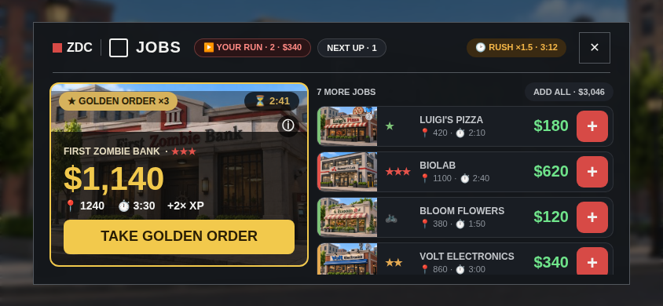
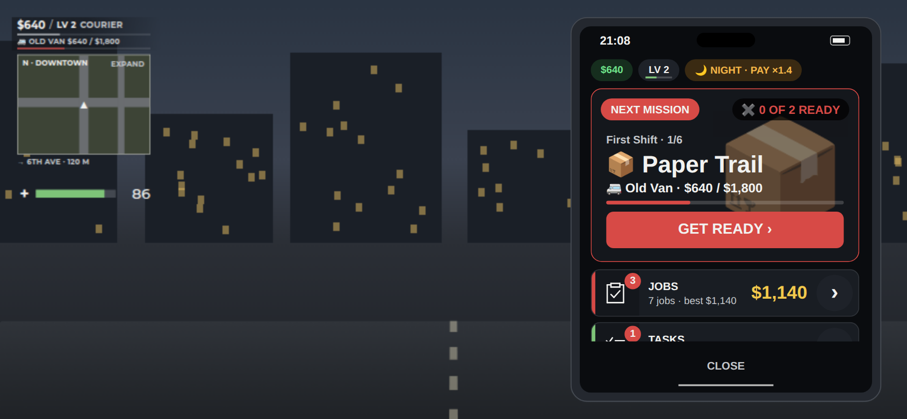

# The UI kit (6.18)

The owner loved the 6.17 JOBS redesign and asked: "I need it unified so the phone looks like that, and the other
popups too." The kit is that look, cut into parts. JOBS (`src/client/JobsView.luau`) and the phone's home
(`src/client/PhoneHome.luau`) are drawn with it. Every other popup moves to it next.

| | |
|---|---|
|  |  |

`home-full.png` shows the whole home list without scrolling.

## Where it lives
- `src/client/CardKit.luau` draws the parts.
- `src/shared/CardLayout.luau` holds the pure maths: when to split, the heights and the row's columns. It is tested in
  `tests/cardlayout_test.luau`.
- `Config.UiKit` (`src/shared/Config.luau`) holds every size. Do not hard-code a size that is already there.
- `tools/phone-ui/check.luau` checks the parts and the home.

## The rules
1. **One big number per item.** It is the thing you get: pay or cash in **money green**
   (`CardKit.Color.money`), or **gold** (`Color.gold`) for something special such as a golden order or a reward.
   A locked item's number is **dim** (`Color.dim`). A thing without a number does not get one.
2. **One primary button per screen.** It is the hero's big button (`bigButton`): red `primary`, `gold` for
   something special, `good` (green) for READY / START, and `shut` (grey) when it can't act and says why. The other
   actions are a row's round "+" / "›" or a chip.
3. **Details on a tap.** A card or row shows a picture, a name, ONE tiny facts line, the value and one action.
   Everything else (addresses, modifiers, the reasons, long words) goes into the details sub-view: tap the row or ⓘ
   to open it, "‹ BACK" to return (`details`).
4. **Accents carry the state, not words.** The colour on a row's left edge or a card's frame, or a chip, says it:
   - the danger tiers (`CardKit.Danger[0..4]`: green, amber, red, purple);
   - red not ready / urgent, green ready / done, amber waiting / a live event / night;
   - gold special, silver a regular's order;
   - grey locked (the picture greyed, `🔒 LV 9` in place of the action).
5. **Big pictures and icons.** Use the business picture (`shared/JobThumbs.luau`), the chapter picture
   (`shared/MissionArt.luau`), an item's icon (`shared/Icons.luau`) or an app glyph (`PhoneContract.glyph`). If no
   picture is uploaded, use the emoji. A hero with only an emoji shows it as a big faint mark at its right.
6. **Secondary state in header chips.** Examples: the run, NEXT UP, rush hour, cash, level and shift. Put them in the
   popup's header strip when they fit (`PhonePopup.bar`), else in a row on top of the body.
7. **Almost no text.** Use caps for names, one facts line made of icon + value pairs ("📍 420 · ⏱ 2:10"), and English
   game text. If a line needs a second sentence, the sentence belongs in the details.
8. **Charcoal surfaces.** Use `Theme.Contract` (`row` cards, `raised` hover / chips, `charcoal` behind pictures). Cards
   have 12 px corners and rows have 10 px corners. Text uses `Theme.HeadingFont` and the big value uses
   `Theme.DisplayFont`.

## The parts (`CardKit`)
| Part | What it is |
|---|---|
| `hero(parent, spec)` | The big card. A picture fills it, with `ribbon` top left, `corner` chip (countdown or state) top right, and ⓘ (`onDetails`). At its foot, over a shade: `title` + `tag`, the big `value`, one `facts` line, an optional `bar`, then one `action` button. `button = true` makes the whole card a button (the phone's home). It returns its parts so a live screen can update them. |
| `row(parent, spec)` | A compact row 52 px tall. It has an `accent` edge, a thumb (`picture`: an image, an emoji or a `glyph`; `thumb` sets its width), a `tag` (danger stars), the `title`, one `facts` line, the big `value`, and a round `action` ("+" with `onAction`, or a "›" mark) or the `lock`'s words. It can also have a `badge`. A tap calls `onOpen`. |
| `setValue(parts, text, color)` | Changes a live row's value and fits its name column again. |
| `chip(parent, spec)` | A small rounded chip. Use `stroke` + `lit` for a selected one and `static` for a state that is not a button. |
| `bigButton(parent, spec)` / `paint(button, kind)` | The primary button and its colours by kind. |
| `sectionHeader(parent, spec)` | "7 MORE JOBS" with a chip at the right ("ADD ALL · $3,046"). |
| `columns(list, spec)` | The hero on the left (`Config.UiKit.HeroShare`) beside the rows when the body is `CardLayout.side` wide (600 px or more), else the hero on top of the rows. |
| `details(list, look, spec)` | A sub-view: "‹ BACK" (or "‹ JOBS") and what `draw` puts under it. |
| `picture` / `repicture` / `shade` | A picture, emoji or glyph filling a frame, swapped when the item changes. |
| `Color`, `Danger`, `Buttons`, `width`, `click` | The palette, the button faces, text width and the click sound. |

Sizes (`Config.UiKit`):
- split from 600 px; hero share 46 %;
- popup hero 196–330 px tall, its value 52 px from 260 px tall, else 42 px;
- phone-home hero 128–190 px, with its button from 178 px;
- row 52 px, thumb 76 px (an app icon 52 px), action 40 px, chips 24 px, gaps 6 px.

## How to move a popup to the kit (wave 2)
For SHOP, BAG, GARAGE, STYLE, MISSIONS, TASKS, REGULARS, CAREER, ESTATE, CREW, BANK, MESSAGES, SETTINGS, READY CHECK
and the HUD's popups:
1. **Pick the hero.** It is the one thing the player most likely wants now:
   - SHOP: what to save up for;
   - GARAGE: the car you drive;
   - TASKS: a reward to claim;
   - READY CHECK: the mission and START;
   - CAREER: the next level.

   Its value is the one big number and its button is the one primary action.
2. **Make the rest rows.** Each row has a picture or icon, a name, one facts line, a value and one action. Put locked
   items last, greyed, with their short lock words.
3. **Move state into header chips.** Examples: the cash, a timer, a count.
4. **Move everything else into the details** (tap the row, ⓘ, "‹ BACK").
5. **Keep every server path, remote and button name the tests use.** Rename a part only if you update
   `tools/phone-ui/check.luau`. Keep gamepad selection: the hero's button or the first row takes the focus.
6. **Use `CardLayout` for any size maths and `Config.UiKit` for the numbers.** Check the result on 844 × 390 and
   320 × 448 as well as the desktop.
