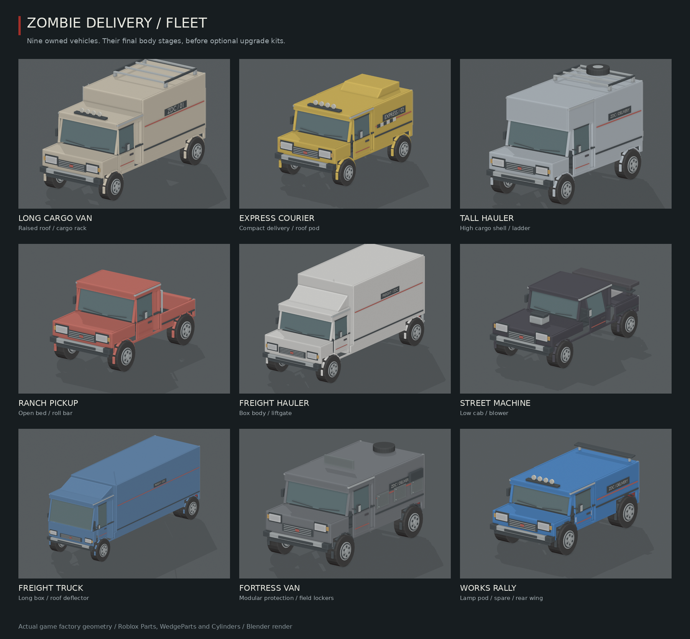
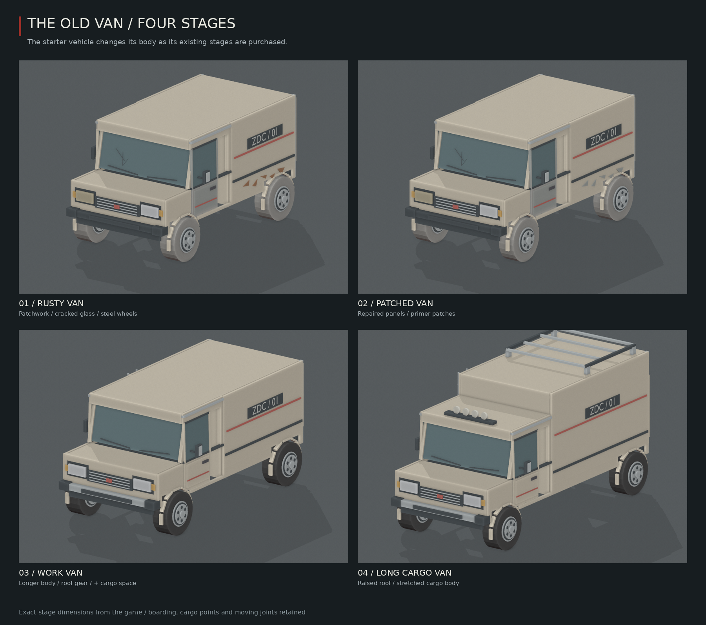
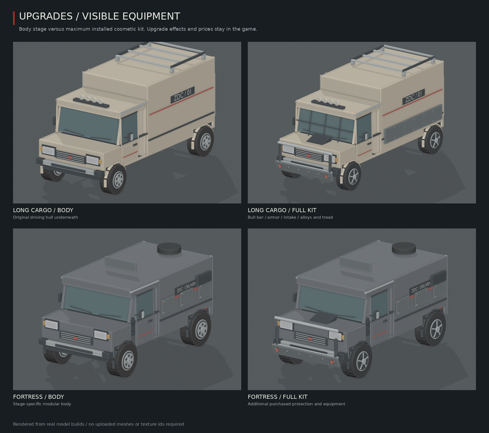

# Zombie Delivery fleet models

The nine owned vehicles now have panelled bodies, framed windows, mirrors, grilles, steel wheels and different stage equipment. This includes all 20 existing stages. The starter van keeps its worn first stages, becomes the longer Work Van, then the raised-roof Long Cargo Van. Purchased upgrades add a tubular bull bar, segmented armor, windshield protection, intake/exhaust details, tread and alloy wheels.







These are renders of the **actual vehicle factory's geometry**, recorded from `Vehicles.displayModel`, using Blender's neutral studio lighting. They are not Roblox Studio screenshots. Each of the 20 stages has a body render and a maximum-kit render: 40 variants in total. Lighting, material textures, glass transparency and shadows will differ in Roblox. The maximum-kit renders demonstrate existing purchased upgrades; they do not give players those upgrades.

## Game integration

- `src/server/VehicleArt/Geometry.luau` describes native Parts, WedgeParts and Cylinders; `Builder.luau` welds them to the chassis, moving doors and rotating tyres. No mesh upload or image asset IDs are required.
- `Vehicles.luau` still owns construction, driving, boarding, cargo, stages and upgrades. The original hidden hulls retain their sizes, positions, collision/raycast settings and mass properties. New skin pieces are massless and do not collide, query or touch. Existing lamp behavior and paint lists receive the new pieces.
- All original seat positions, door and wheel joint frames, loading/boarding/drive/jack attachments and capacities are retained. Roof equipment clears the existing roof-gun location. The hand trolley and cargo systems use their existing mounts.
- Company vehicles and ambient traffic retain their original bodies. The detailed skin is confined to supported owned vehicles and dealer displays. Maximum-kit references stay below 450 BaseParts per vehicle; this is an authoring budget, not a measured device performance guarantee.
- `client/VehiclePreview.luau` replaces the garage's owned-car drawing with a cached ViewportFrame. The active car uses a sanitized local copy of its streamed model, including its installed kit. A parked or unstreamed car uses its actual stage and paint from generated snapshots. Parked snapshots show the stage body, without installed kit details. Company vehicles retain their existing drawing. No per-frame traversal or new event connections are added.
- `Garages.luau` adds only read-only `stage` and `paint` fields to the garage response. Progression, prices, rewards, saves and physics tuning are unchanged.

## Roblox files

The accompanying delivery package contains:

- `zombie-delivery-fleet.rbxm`: an **anchored model reference library**, all 40 variants arranged on a spaced grid in folders by car. Import through Studio's **Insert from File**. These are static references, without drive scripts or live door/wheel motors. Avoid leaving the entire reference grid in the production map.
- `zombie-delivery-vehicles.rbxl`: the complete game built from this review branch. Open in Roblox Studio and press Play to use its existing vehicle systems with the new art.
- Three review sheets and 40 individual PNG previews. Optional GLB exports are produced by the renderer for inspection outside Roblox; the native RBXM is the Roblox reference format.

The production change is on `codex/vehicle-models`. Claude reviews it and merges it to `main`; the owner's usual `git pull` and `node tools/rojo-sync.js zombie-delivery` then pick it up. Importing the reference library alone does not update the game's factory.

## Rebuild the data and previews

From the repository root, with Python 3, Pillow, Luau CLI, Blender and Rojo installed:

```sh
python3 zombie-delivery/tools/vehicle-preview/export_fleet.py luau /tmp/zdc-fleet
python3 zombie-delivery/tools/vehicle-preview/make_preview_data.py /tmp/zdc-fleet/fleet.json
python3 zombie-delivery/tools/vehicle-preview/check_fleet.py luau
blender -b -t 6 --python zombie-delivery/tools/vehicle-preview/render_blender.py -- /tmp/zdc-fleet/fleet.json /tmp/zdc-fleet/renders --workbench
python3 zombie-delivery/tools/vehicle-preview/make_sheets.py /tmp/zdc-fleet/renders zombie-delivery/design/vehicle-models
python3 zombie-delivery/tools/vehicle-preview/write_models.py /tmp/zdc-fleet/fleet.json /tmp/zdc-fleet/fleet.rbxmx
```

`make_preview_data.py` writes `src/shared/VehiclePreviewData.luau`. Regenerate after changing factory geometry. The small catalog is decoded lazily; only the selected garage model is instantiated locally. `make_sheets.py` uses the system DejaVu Sans font. To serialize the native library, point a temporary Rojo project at `fleet.rbxmx` and build it to `.rbxm`. Build the complete game with `rojo build zombie-delivery/default.project.json -o /tmp/zombie-delivery-vehicles.rbxl`.

The export recorder implements geometry and instance properties, **not Roblox physics**. It temporarily exposes the real vehicle factory inside an isolated directory; it does not add test hooks to the game's source. The compatibility checker compares the new factory against immutable base commit `3823dad` (game 4.2); `--baseline` overrides that reference explicitly.

## Validation and Studio handoff

Checked in the cloud environment on 2026-10-06:

- Required suite: **23 test files / 483 reported checks**, stage/body/capacity audit, every module compiled with Luau 0.741 at `-O0 -g2`.
- Fleet checker: real player builds at all 20 stages, upgraded builds, 40 anchored display variants; original hulls, seats, joint frames, loading points and capacities match the baseline. New skin weld targets and nonblocking flags are checked. The snapshot catalog matches the factory.
- Actual garage-preview code exercised with the instance recorder: stage and paint selection, live upgraded clone, stable cache, sanitized clones and company fallback.
- Rojo 7.4.4 built both the complete game and native model library successfully.
- The owner's root sync command served the MessagePack handshake and 138 instances, including `VehicleArt`, `VehiclePreview` and `VehiclePreviewData`.

Commands for the code checks:

```sh
python3 zombie-delivery/tests/run_tests.py /path/to/luau
python3 zombie-delivery/tools/vehicle-preview/check_fleet.py /path/to/luau
```

Roblox Studio is unavailable in this cloud environment. Claude should check the following before merging:

1. Driver/passenger boarding, both cab doors, open rear doors, cargo loading/unloading, jack and trolley; each starter-van stage after rebuilding.
2. Repaint and individual plow/armor/engine/handling upgrades; spinning rims, tread, attachment clearance, roof gun and day/night lights. Check a second player's view too.
3. Garage on desktop and the device emulator: stage/paint selection, active kit preview, parked body preview, fit in its drawing slot, close/reopen and repeated selections.
4. Several owned vehicles together and the dealership: frame time, streaming and memory on a phone. The checker does not substitute for an in-engine physics, type or performance test.
